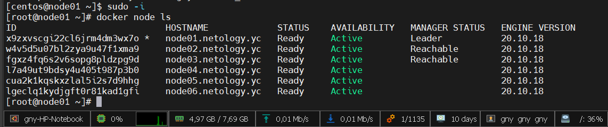
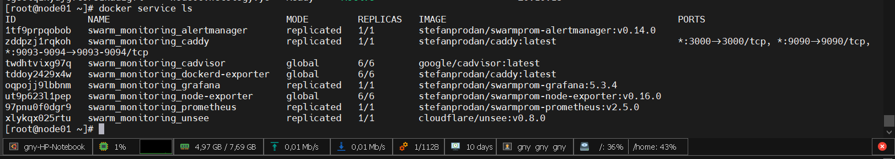
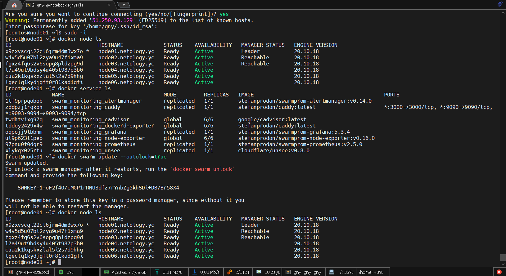

# Домашнее задание к занятию "5.5. Оркестрация кластером Docker контейнеров на примере Docker Swarm"

## Задача 1

Дайте письменые ответы на следующие вопросы:

- В чём отличие режимов работы сервисов в Docker Swarm кластере: replication и global?
---
В режиме replicated сервисы запускаются в определенном пользователем количестве экземпляров. Поддержание заданного количества экземпляров определяет manager, в том числе и на каких нодах они будут запущены. 

В режиме global сервисы запускаются на каждой ноде в единственном экземпляре.

---

- Какой алгоритм выбора лидера используется в Docker Swarm кластере?
---
В Docker Swarm кластере используется алгоритм поддержания распределенного консенсуса — Raft. 
Ноды кластера могут находиться в 3-х состояниях:
Фаловер, Кандидат, Лидер.
Лидером должен быть только один.
Лидер постоянно обменивается с фаловерами  hartbeat-пакетами. Когда фаловеры кластера перстают слышать лидера, они переходят в статус кандидатов и начинают процесс выборов после истечения таймаута выбора, случайно определенного для каждой ноды. Кандидат отправляет всем нодам запрос на голосование, ноды у котрых еще не истек таймаут выбора голосуют за инициатора и меняют свой статус с кандидата на фаловера, у которых истек - за себя и отправляют запрос остальным нодам, затем лидер определяется большинством голосов. Далее Лидер реплицирует изменения кластера, полученные от клиента на весь кластер посредством подтверждения (commit) от большинства нод кластера.

---

- Что такое Overlay Network?
---
Это логическая сеть создаваемая поверх другой сети. В случае с Docker обеспечивает нахождение контейнеров, расположенных на разных хостах кластера swarm в одной Overlay сети.

---

## Задача 2

Создать ваш первый Docker Swarm кластер в Яндекс.Облаке

Для получения зачета, вам необходимо предоставить скриншот из терминала (консоли), с выводом команды:
```
docker node ls
```
Выполнено:
<p align="center">
  
</p>

## Задача 3

Создать ваш первый, готовый к боевой эксплуатации кластер мониторинга, состоящий из стека микросервисов.

Для получения зачета, вам необходимо предоставить скриншот из терминала (консоли), с выводом команды:
```
docker service ls
```
Выполнено:
<p align="center">
  
</p>

## Задача 4 (*)

Выполнить на лидере Docker Swarm кластера команду (указанную ниже) и дать письменное описание её функционала, что она делает и зачем она нужна:
```
# см.документацию: https://docs.docker.com/engine/swarm/swarm_manager_locking/
docker swarm update --autolock=true
```
Выполнено:
<p align="center">
  
</p>

Данная команда --autolock=true включает шифрование хранящихся открыто ключей шифрования TLS (для обмена данными между нодами кластера) и ключей шифрования/дешифрования логов Raft управляющих нод существующего кластера. При включении данной блокировки шифрования генерируется ключ, которым будут зашифрованы ключи TLS и лог Raft, и который надо будет вводить каждый раз для запуска сервиса docker swarm в случае перезапуска управляющего узла. 

---


### Как cдавать задание

Выполненное домашнее задание пришлите ссылкой на .md-файл в вашем репозитории.

---
